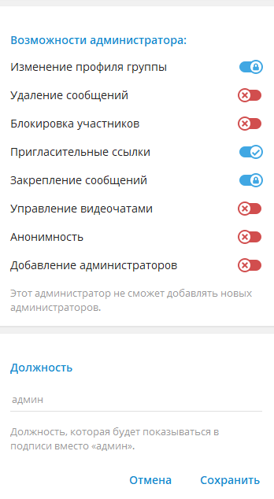

# Чат бот amaxi_uved_bot
### Предназначен для автоматизации сборки товаров по заказам

Предварительно бот должен быть добавлен в чат, группу, канал.
В настройках группы боту необходимо предоставить права администратора и включить следующие возможности:

- - -
Все данные для авторизации и доступа хранятся в отдельном файле config.py
Необходимо в данном файле задать значение переменных:
- для телеграмм бота:
- - TOKEN - токен вашего бота.
- для доступа по API ABCP:
- - HOST_API - адрес вашего API на платформе abcp.ru
- - USER_API - ваш логин 
- - -